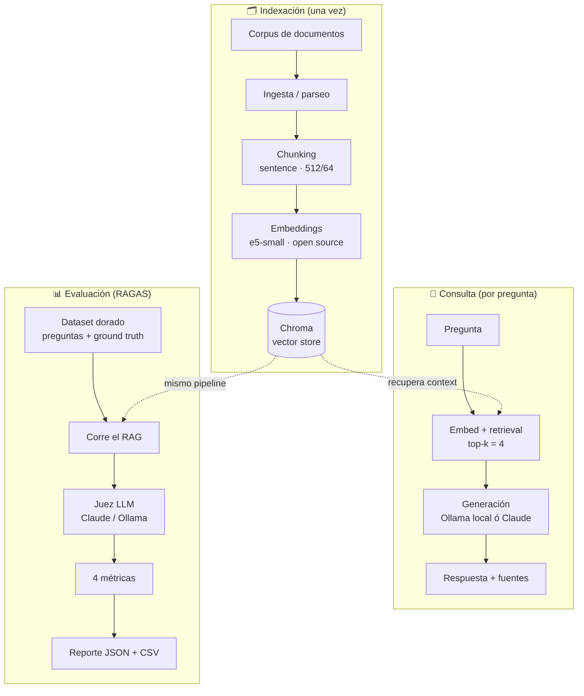
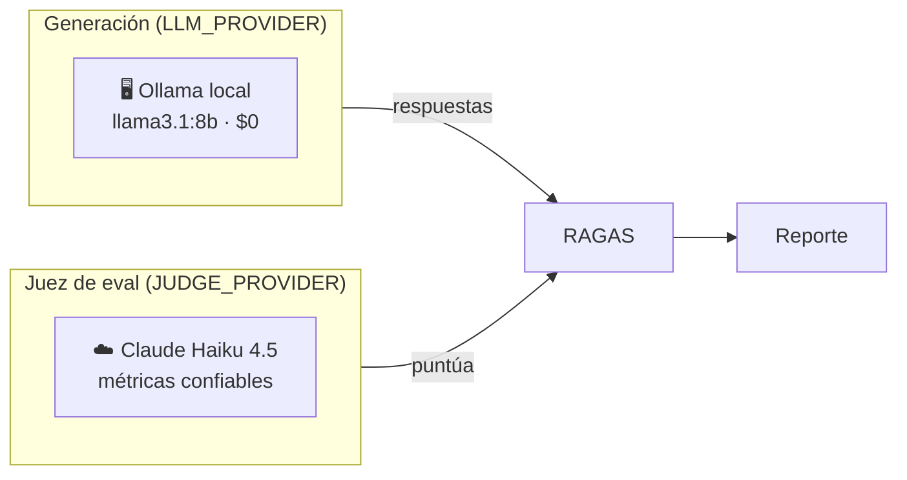
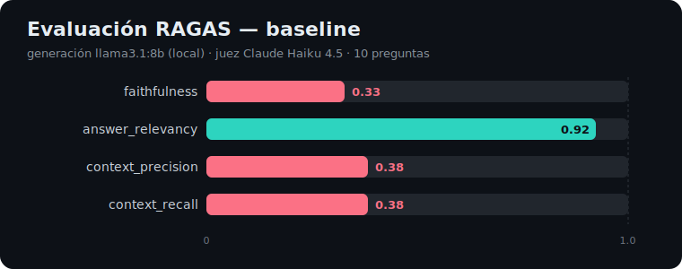

<p align="center">
<a href="https://www.linkedin.com/in/soriamaximilianorodrigo/" target="_blank" rel="noopener noreferrer">
</a>
</p>

<p align="center">
  <a href="#"></a>
  <a href="#"></a>
  <a href="#"></a>
  <a href="#"></a>
  <a href="#"></a>
</p>

<p align="center">
  <a href="https://github.com/DietrichGebert/ponytail"></a>
  
  
</p>

<p align="center">
  
</p>

<!-- dynamic-badges -->
<p align="center">
  <a href="https://github.com/MaximilianoRodrigoSoria/rag-pipeline-eval/actions"></a>
  <a href="LICENSE"></a>
  
  
  <a href="https://maximilianorodrigosoria.github.io/rag-pipeline-eval/"></a>
  
</p>

<hr/>

<h1 align="center">rag-pipeline-eval</h1>

<p align="center">
Pipeline de <b>Retrieval-Augmented Generation</b> sobre un corpus propio, con un módulo de
<b>evaluación automatizada</b> que mide la calidad de las respuestas (faithfulness y relevancia)
en lugar de asumirla.
</p>

## ¿Qué resuelve este proyecto?

Un RAG es fácil de armar y difícil de confiar. Cualquiera conecta un LLM a un vector store y obtiene respuestas que *suenan* bien; el problema es que "suena bien" no es una métrica. Cuando cambiás el tamaño de chunk, el modelo de embeddings o el `top_k`, ¿mejoró o empeoró? Sin medición, es una caja negra y las decisiones se toman por intuición.

Este proyecto cierra ese hueco: construye el RAG end-to-end **y** le adosa un módulo de evaluación reproducible. Cada respuesta se juzga contra un dataset de referencia con cuatro métricas objetivas, y el resultado queda en un reporte versionado que se regenera en cada cambio del pipeline. El diferencial no es "que responda", sino **demostrar con números que responde bien**: sin alucinar, atendiendo a la pregunta y recuperando el contexto correcto.

## ¿Qué pasos sigue?

El pipeline tiene tres flujos: se **indexa** el corpus una vez, se **consulta** por cada pregunta, y se **evalúa** la calidad de forma automatizada.



## Qué hace cada parte

Cada etapa está aislada en su propio módulo, con una interfaz intercambiable, para poder comparar configuraciones (que es justamente el insumo de la evaluación).

| Componente | Módulo | Responsabilidad |
|---|---|---|
| **Ingesta** | `ingestion/loaders.py` | Carga y parsea los documentos del corpus según su tipo (PDF, MD, HTML, TXT). |
| **Chunking** | `ingestion/chunking.py` | Trocea el texto en fragmentos manejables (estrategia `sentence` o `semantic`), con solapamiento para no cortar ideas. |
| **Embeddings** | `embeddings/embedder.py` | Convierte cada chunk en un vector numérico. Modelo open source (`e5-small`), corre local y sin costo. |
| **Vector store** | `vectorstore/store.py` | Persiste los vectores en Chroma y resuelve la búsqueda por similitud. Abstracción común para migrar a Qdrant. |
| **Retrieval** | `retrieval/retriever.py` | Dada una pregunta, recupera los `top_k` chunks más parecidos que sirven de contexto. |
| **Generación** | `generation/rag_chain.py` | Arma el prompt con la pregunta + el contexto y pide la respuesta al LLM (Ollama local o Claude). |
| **API** | `api/main.py` | Expone el pipeline como servicio: `POST /query` con inyección de dependencias y ejecución async. |
| **Evaluación** | `eval/run_eval.py` | Corre el RAG sobre el dataset dorado y calcula las 4 métricas de RAGAS. Genera el reporte. |

## Por qué es bueno tenerlo

**Decisiones con datos, no con intuición.** Cada cambio de configuración (chunking, embeddings, `top_k`, modelo) se puede comparar contra un baseline con números concretos.

**Reproducibilidad.** El reporte de evaluación se versiona junto al código; cualquiera puede regenerarlo y obtener el mismo resultado.

**Detecta alucinaciones.** La métrica de faithfulness expone cuándo el modelo "inventa" afirmaciones que el contexto no respalda — el riesgo número uno de un RAG en producción.

**Portátil y sin costo obligatorio.** Corre 100% local con Ollama (cero gasto) y conmuta a Claude por API cuando se quiere más calidad, sin tocar código.

## Generación local + juez Claude (conmutable)

El proyecto separa **quién genera** las respuestas de **quién las evalúa**. Así se puede generar gratis en local y juzgar con un modelo más confiable, todo por configuración (`.env`):



Se controla con estas variables:

| Variable | Rol | Ejemplo |
|---|---|---|
| `LLM_PROVIDER` | Proveedor de **generación** | `ollama` (local, sin costo) |
| `JUDGE_PROVIDER` | Proveedor del **juez** de eval | `anthropic` (Claude) |
| `JUDGE_MODEL` | Modelo del juez (si es Claude) | `claude-haiku-4-5-20251001` |

> **Por qué separarlos:** un modelo local 8B genera respuestas razonables, pero como *juez* es inconsistente al producir el JSON estructurado que RAGAS necesita, y devuelve `NaN` en `faithfulness` y `context_precision`. Un modelo Claude barato (Haiku) resuelve eso y entrega las 4 métricas, manteniendo la generación gratis en local.

## Métricas explicadas y resultados

RAGAS mide cuatro dimensiones independientes de la calidad de un RAG:

| Métrica | Qué mide | Cómo se lee |
|---|---|---|
| **faithfulness** | ¿Las afirmaciones de la respuesta están respaldadas por el contexto recuperado? | Alto = **no alucina**; se apega a las fuentes. |
| **answer_relevancy** | ¿La respuesta contesta realmente lo que se preguntó? | Alto = **enfocada**, sin relleno ni divagues. |
| **context_precision** | De lo recuperado, ¿lo relevante quedó bien rankeado arriba? | Alto = **poco ruido** en el contexto. |
| **context_recall** | ¿El contexto recuperado cubre toda la información necesaria (vs. la respuesta de referencia)? | Alto = **no se pierde** info clave. |

### Resultados del baseline

Generación con `llama3.1:8b` (local) y juez Claude Haiku 4.5, sobre el dataset dorado de ejemplo:

<p align="center">
  
</p>

| Métrica | Resultado | Lectura |
|---|:---:|---|
| answer_relevancy | **0.92** | ✅ Las respuestas están bien enfocadas a la pregunta. |
| faithfulness | **0.33** | ⚠️ El modelo local agrega afirmaciones no respaldadas por el contexto (riesgo de alucinación). |
| context_precision | **0.38** | ⚠️ El retrieval mezcla ruido: lo relevante no siempre queda arriba. |
| context_recall | **0.38** | ⚠️ El contexto recuperado no cubre toda la info esperada. |

**Interpretación.** El pipeline **contesta de forma relevante** (0.92), pero el **retrieval es el cuello de botella** (precision y recall ~0.38) y arrastra la fidelidad hacia abajo: si el contexto llega incompleto o con ruido, el modelo lo completa con su propio conocimiento y baja la faithfulness. Es un baseline honesto sobre un corpus de ejemplo mínimo — y ese es el punto: **los números dicen dónde mejorar**, no solo que "anda".

**Palancas de mejora** (cada una re-evaluable para comparar): ampliar el corpus, chunking `semantic`, agregar un reranker, subir `top_k`, mejores embeddings, o conmutar la generación a Claude. La gracia es que ahora cada cambio se mide, no se supone.

## Stack tecnológico

- **Lenguaje:** Python 3.11+
- **Orquestación RAG:** LangChain o LlamaIndex (elegir uno; LlamaIndex es más directo para RAG puro)
- **Embeddings:** `text-embedding-3-small` (OpenAI) o `bge-small`/`e5` (open source vía `sentence-transformers`) para una variante sin costo
- **Vector store:** Chroma (local, cero fricción para empezar) con opción de migrar a Qdrant (producción, filtros, escalado)
- **LLM de generación:** OpenAI / Anthropic / un modelo local vía Ollama
- **Evaluación:** RAGAS (faithfulness, answer_relevancy, context_precision, context_recall) y/o DeepEval
- **API:** FastAPI (endpoint `/query`)
- **Ingesta/parseo:** `unstructured`, `pypdf`, `markdown` según el formato del corpus
- **Testing / calidad:** pytest, ruff, black

## Estructura de carpetas

Sigue el **src layout con paquete nombrado** (estándar de mercado para un paquete instalable):

```
rag-pipeline-eval/
├── README.md
├── AGENTS.md                     # Ruleset ponytail (código mínimo)
├── pyproject.toml
├── .env.example
├── data/
│   ├── raw/                      # Corpus original (PDF, MD, HTML, TXT)
│   ├── interim/                  # Intermedios de procesamiento
│   ├── processed/                # Vector store (Chroma) — git-ignored
│   └── external/                 # Datos de terceros
├── src/
│   └── rag_pipeline_eval/        # Paquete importable
│       ├── config.py            # Settings (pydantic-settings): modelos, chunk size, top_k
│       ├── ingestion/
│       │   ├── loaders.py       # Carga por tipo de documento
│       │   └── chunking.py      # Estrategias de chunking (sentence, semantic)
│       ├── embeddings/
│       │   └── embedder.py      # Modelo de embeddings (factory intercambiable)
│       ├── vectorstore/
│       │   └── store.py         # Abstracción Chroma/Qdrant (interfaz común)
│       ├── retrieval/
│       │   └── retriever.py     # Índice + búsqueda por similitud
│       ├── generation/
│       │   └── rag_chain.py     # Prompt + recuperación + LLM (Claude/Ollama)
│       └── api/
│           └── main.py          # FastAPI: POST /query
├── scripts/
│   ├── index.py                 # Indexación idempotente (CLI)
│   └── check_judge.py           # Smoke test del juez (1 llamada) antes de evaluar
├── eval/
│   ├── datasets/
│   │   └── qa_golden.jsonl      # Preguntas + respuestas de referencia
│   ├── run_eval.py              # Corre RAGAS y genera el reporte
│   └── reports/                 # Salidas de evaluación (JSON/CSV) versionadas
├── notebooks/                   # Exploración y tuning de chunking/top_k
└── tests/                       # Espejan src/: tests/ingestion/, etc.
    ├── ingestion/
    │   └── test_chunking.py
    └── test_config.py
```

## Puesta en marcha (scaffold generado)

Stack de arranque: **LlamaIndex** + **embeddings open source** (sentence-transformers, corren en local) + **Ollama/Claude** para la generación + **Chroma** como vector store.

### 1. Instalar dependencias (Poetry)

```bash
poetry install                 # dependencias base
poetry install --with eval,dev # + evaluación (RAGAS) y herramientas de dev
```

### 2. Configurar el entorno

```bash
cp .env.example .env
# Editar .env: elegir LLM_PROVIDER (ollama/anthropic) y, para el juez,
# JUDGE_PROVIDER + JUDGE_MODEL (+ ANTHROPIC_API_KEY si se usa Claude)
```

### 3. Indexar el corpus

Dejá tus documentos en `data/raw/` (ya hay dos de ejemplo) y corré:

```bash
poetry run python -m scripts.index          # idempotente
poetry run python -m scripts.index --force  # re-indexar
```

### 4. Levantar la API y consultar

```bash
poetry run uvicorn rag_pipeline_eval.api.main:app --reload
# En otra terminal:
curl -X POST localhost:8000/query -H "Content-Type: application/json" \
  -d '{"question": "¿Qué mide la métrica faithfulness?"}'
```

### 5. Evaluar la calidad

```bash
poetry run python -m scripts.check_judge          # verifica el juez (1 llamada)
poetry run python -m eval.run_eval --tag baseline # corre las 4 métricas
# Reporte en eval/reports/baseline-<timestamp>.json
```

### Tests

```bash
poetry run pytest
```

> El código está organizado por responsabilidad en `src/rag_pipeline_eval/`
> (ingestion, embeddings, vectorstore, retrieval, generation, api), con interfaces
> intercambiables para poder comparar configuraciones — que es el insumo del
> módulo de evaluación.
